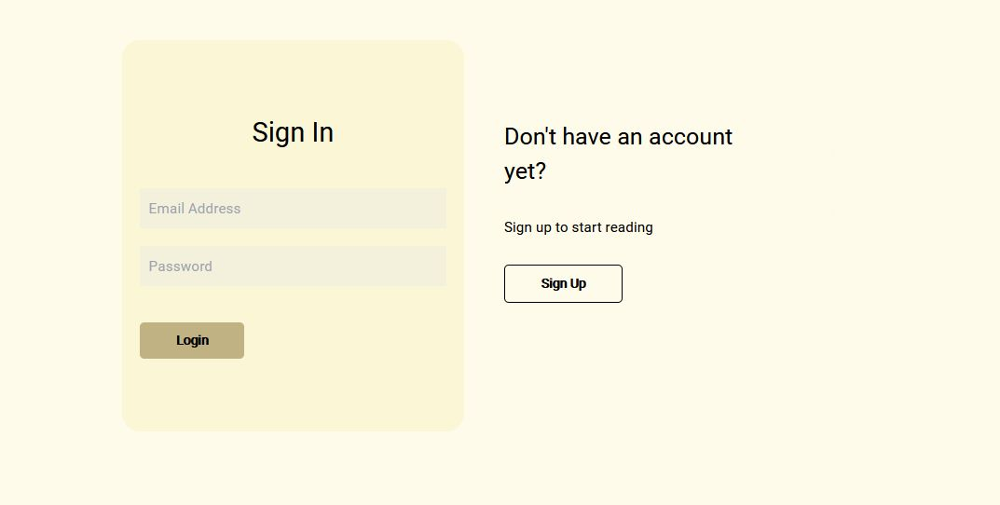
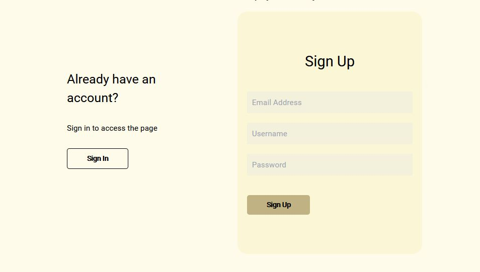
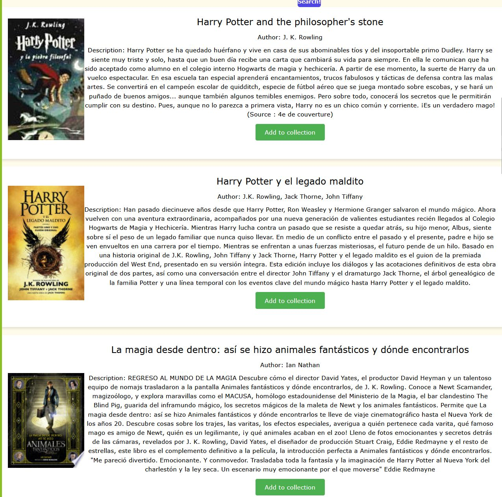

# <Forbidden Bookshelf>

## Description

Forbidden Bookshelf is a personal book collection management system designed for book lovers and avid readers. Users can create a personal account with a unique login to securely access their bookshelf from any device. With an easy-to-use interface, users can search for books and add them to their bookshelf effortlessly. The application also includes a backup feature, ensuring users never lose their book collection when switching devices. It's a valuable tool for book lovers and avid readers who want to keep track of their personal book collection and access it from any device.

USER STORY

As a book lover and avid reader
I WANT to manage my personal book collection,
I WANT to create a personal account with a unique login so that I can securely access my bookshelf from any device,
SO THAT I can search for books and add them to my bookshelf with ease.
Finally, I want to be able to back-up my bookshelf data on a server, so that I never lose my book collection even if I switch devices.


## Table of Contents

- [Installation](#installation)
- [Usage](#usage)
- [Credits](#credits)
- [License](#license)

## Installation

This API can be accessed through a website, so the final user does not need to install any software other than a web browser and have internet access.

## Usage

First go to the site [Add link name here](Add link here).
Sign in if you are a new user.
If you are already registered, log in into your account.
At home, you will see a carousel with some of the books in your bookshelf, under that, you will find a search option.
When you enter the title of the book you want to add to your bookshelf, you will be presented with 10 search results, click on the "add to collection" button to add it to your personal bookshelf.
You can find your book in the History section along all the other books in your collection.

Screenshots

    ```Sign in and sign up
    
        
    ```

    ```Login and singin
    
        
    ```

## Credits

This project was created by:

- [Aarón Agraz Huitron](https://github.com/TheBigMotif) - Front-end developer
- [Angelina Huerta Cortés](https://github.com/TenshiAngelina) - Back-end developer
- [Francisco Monteon](https://github.com/MonteonFrank) - Back-end developer
- [Salvador Espinosa Valdez](https://github.com/EspinosaSalvador) - Front and back-end developer
- [Saúl Wade](https://github.com/saulwade) - Front-end developer

We would like to thank the following individuals for their contributions:

- [Enrique Choza](https://github.com/enriquechoza) - Provided valuable feedback and troubleshooting during development
- [Emmanuel Zamudio](https://github.com/ezamudio) - Provided valuable information to smoothly install and use Tailwind and Heroku

Thank you to all of our team members and contributors for making this project a success!

## License

MIT License

Copyright (c) [2023]

Permission is hereby granted, free of charge, to any person obtaining a copy
of this software and associated documentation files (the "Software"), to deal
in the Software without restriction, including without limitation the rights
to use, copy, modify, merge, publish, distribute, sublicense, and/or sell
copies of the Software, and to permit persons to whom the Software is
furnished to do so, subject to the following conditions:

The above copyright notice and this permission notice shall be included in all
copies or substantial portions of the Software.

THE SOFTWARE IS PROVIDED "AS IS", WITHOUT WARRANTY OF ANY KIND, EXPRESS OR
IMPLIED, INCLUDING BUT NOT LIMITED TO THE WARRANTIES OF MERCHANTABILITY,
FITNESS FOR A PARTICULAR PURPOSE AND NONINFRINGEMENT. IN NO EVENT SHALL THE
AUTHORS OR COPYRIGHT HOLDERS BE LIABLE FOR ANY CLAIM, DAMAGES OR OTHER
LIABILITY, WHETHER IN AN ACTION OF CONTRACT, TORT OR OTHERWISE, ARISING FROM,
OUT OF OR IN CONNECTION WITH THE SOFTWARE OR THE USE OR OTHER DEALINGS IN THE
SOFTWARE..
